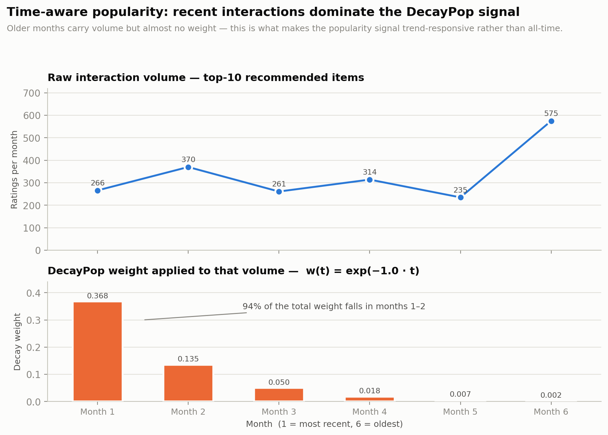
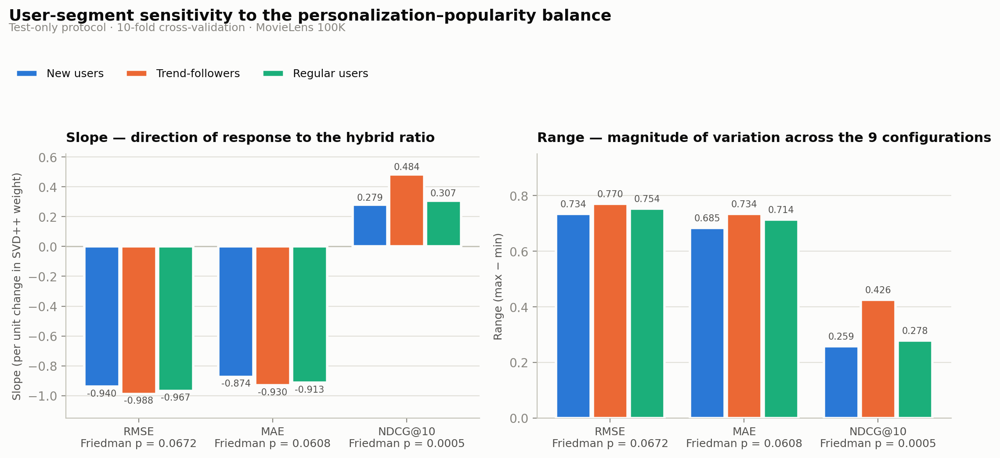

# Hybrid Recommendation System with Personalized and Time-Aware Popularity Modeling

A hybrid recommendation system that combines personalized recommendation using **SVD++** with **time-aware popularity modeling using DecayPop** to investigate the trade-off between recommendation relevance, popularity bias, and catalogue exposure.

This repository contains the experimental implementation for the research project:

**Ria Siti Juairiah, Teguh Bharata Adji, and Igi Ardiyanto, “Analyzing the Popularity–Personalization Trade-off in a Hybrid SVD++–DecayPop Recommendation System.”**

This work investigates a hybrid recommendation framework that combines **personalized collaborative filtering using SVD++** with **time-aware popularity modeling using DecayPop**. The study analyzes how different hybridization ratios affect recommendation accuracy, catalogue coverage, and popularity-related characteristics across different user segments.

The work is currently in the **final presentation stage** and is scheduled to be presented at **ICAIS 2026 in Kuala Lumpur, Malaysia**, at the end of September 2026. The conference is **IEEE-supported**.

> **Status:** Accepted / scheduled for final presentation at ICAIS 2026, Kuala Lumpur, Malaysia — September 2026.

The repository provides the experimental code, selected results, evaluation procedures, and supporting materials to facilitate reproducibility and further development of the proposed recommendation framework.


---

## 1. Business Problem

Recommendation systems are increasingly used by digital platforms to help users discover relevant products, movies, content, and services. However, recommendation systems face an important trade-off.

Highly personalized recommendations can effectively match individual preferences, but may repeatedly recommend a relatively small group of popular items. On the other hand, popularity-based recommendation can capture current trends and broaden content exposure, but may provide less personalization.

This creates a business challenge:

> **How can a recommendation system balance individual user preferences with changing popularity trends while maintaining broader catalogue exposure?**

This project investigates a hybrid recommendation strategy that combines personalization and time-aware popularity, and examines whether the appropriate balance differs across user segments.

---

## 2. Proposed AI Solution

The proposed system combines two complementary recommendation strategies:

### SVD++

SVD++ is used as the personalized recommendation component. It learns latent representations from historical user-item interactions and captures individual user preferences.

### DecayPop

DecayPop provides a time-aware popularity signal. Recent interactions receive
greater influence than older interactions, allowing the popularity component
to reflect changing user interests and trends over time.



*Figure 2. Time-aware popularity modelling using DecayPop.*

### Hybrid Recommendation

The two components are combined using different weighting configurations to investigate how the balance between personalization and popularity affects recommendation outcomes.

The experiment evaluates nine configurations ranging from:

**10% SVD++ : 90% DecayPop**

to

**90% SVD++ : 10% DecayPop**

---

## 3. Why Combine Personalization and Popularity?

The two approaches provide complementary capabilities.

| Component    | Main Strength                                      | Main Limitation                                                   |
| ------------ | -------------------------------------------------- | ----------------------------------------------------------------- |
| SVD++        | Captures individual user preferences               | May concentrate recommendations around repeatedly preferred items |
| DecayPop     | Captures recent popularity trends                  | Provides less individualized recommendations                      |
| Hybrid Model | Combines personalization and time-aware popularity | Requires an appropriate balance between the two signals           |

The hybrid approach therefore provides a framework for studying the trade-off between **personal relevance** and **broader catalogue exposure**.

---

## 4. Research Questions

This project investigates two main questions:

**RQ1.** How do different hybrid ratios of personalized and popularity-based recommendation affect recommendation accuracy and catalogue coverage?

**RQ2.** Does sensitivity to changes in hybrid ratios differ across user segments, and which segments exhibit the greatest sensitivity?

---

## 5. Dataset

The experiment uses the **MovieLens 100K** dataset.

| Property                  |   Value |
| ------------------------- | ------: |
| Original ratings          | 100,000 |
| Users                     |     943 |
| Movies                    |   1,682 |
| Minimum user interactions |       5 |
| Minimum item interactions |      10 |
| Ratings after filtering   |  97,953 |

Users with fewer than five interactions and items with fewer than ten interactions are excluded during preprocessing.

The raw and processed datasets are not included in this repository. This keeps the repository lightweight while allowing the experimental pipeline and selected results to remain available for reproducibility.

---

## 6. Methodology

The experimental workflow consists of the following stages:

1. Data preprocessing and filtering
2. 10-fold cross-validation
3. Training and evaluation of SVD++
4. Time-aware popularity modelling using DecayPop
5. Hyperparameter optimization using Optuna
6. Construction of hybrid recommendation scores
7. Evaluation across nine hybrid configurations
8. User segmentation
9. Accuracy and catalogue-level evaluation
10. Statistical sensitivity analysis

### Overall Pipeline

```text
                    User-Item Interactions
                              │
                              ▼
                    Data Preprocessing
                              │
                              ▼
                     10-Fold Cross-Validation
                              │
                  ┌───────────┴───────────┐
                  ▼                       ▼
                SVD++                  DecayPop
          Personalized Signal      Time-Aware Popularity
                  │                       │
                  └───────────┬───────────┘
                              ▼
                    Hybrid Recommendation
                              │
                              ▼
                  9 Hybrid Configurations
                              │
                              ▼
                      User Segmentation
                              │
                              ▼
                  Evaluation & Sensitivity
                              │
                              ▼
                    Business-Oriented Insights
```

---

## 7. Hybrid Configurations

Nine hybrid configurations are evaluated by varying the contribution of SVD++ and DecayPop.

| Configuration | SVD++ | DecayPop |
| ------------- | ----: | -------: |
| 10:90         |   10% |      90% |
| 20:80         |   20% |      80% |
| 30:70         |   30% |      70% |
| 40:60         |   40% |      60% |
| 50:50         |   50% |      50% |
| 60:40         |   60% |      40% |
| 70:30         |   70% |      30% |
| 80:20         |   80% |      20% |
| 90:10         |   90% |      10% |

These configurations are evaluated to identify how changes in the personalization-popularity balance affect different recommendation objectives.

---

## 8. User Segmentation

The experiment also investigates whether different types of users respond
differently to changes in the hybrid ratio.

Three user segments are evaluated:

- **New Users**
- **Regular Users**
- **Trend-Followers**

Sensitivity analysis is used to examine whether the effect of changing the
SVD++ and DecayPop weights is consistent across these segments.



*Figure 1. Sensitivity of recommendation performance to hybrid-ratio changes
across user segments.*

---

## 9. Evaluation

The system is evaluated from several complementary perspectives.

### Recommendation Accuracy

* Precision
* Recall
* F1-score
* NDCG@10

These metrics measure how effectively the recommendation system retrieves and ranks relevant items.

### Popularity and Concentration

* Average Recommendation Popularity (ARP)
* Gini Index

These metrics help evaluate the degree of popularity bias and concentration in the recommendation results.

### Catalogue Exposure

* Catalogue Coverage

Catalogue coverage measures how broadly the recommendation system exposes items across the available catalogue.

### Statistical Analysis

The sensitivity of recommendation performance to hybrid-ratio changes is evaluated using:

* Friedman test
* Post-hoc analysis

---

## 10. Key Results

The experiments demonstrate that changing the relative contribution of personalization and time-aware popularity produces different effects across recommendation objectives.

Selected results include:

| Measure                               |        Result |
| ------------------------------------- | ------------: |
| SVD++ RMSE                            |        0.9108 |
| SVD++ MAE                             |        0.7058 |
| DecayPop ARP                          |        50.68% |
| SVD++ Catalogue Coverage              |        0.7266 |
| Hybrid Catalogue Coverage             | 0.7265–0.7576 |
| DecayPop Test-only Catalogue Coverage |        0.7731 |

The results indicate a trade-off between recommendation accuracy and catalogue exposure as the relative contribution of SVD++ and DecayPop changes.

Importantly, the effect of the hybrid ratio is not uniform across users. User segments demonstrate different levels of sensitivity to changes in the personalization-popularity balance.

---

## 11. Business Implications

The proposed framework can support businesses operating recommendation-driven platforms, including:

* e-commerce platforms,
* entertainment and streaming services,
* digital content platforms,
* online marketplaces, and
* personalized discovery services.

Potential business benefits include:

* **Improved personalization** by incorporating individual user preferences.
* **Better utilization of recent trends** through time-aware popularity modelling.
* **Broader catalogue exposure** by reducing dependence on a limited set of highly popular items.
* **Segment-aware recommendation strategies** by identifying differences in user responses.
* **Flexible recommendation policies** by allowing businesses to adjust the balance between personalization and popularity according to their objectives.

The framework can therefore be viewed not only as a recommendation algorithm, but also as a mechanism for exploring different **business trade-offs between personalization, trend responsiveness, and catalogue exposure**.

---

## 12. Repository Structure

```text
.
├── notebooks/
│   └── 01_sanity_check.ipynb
│
├── src/
│   └── ...
│
├── scripts/
│   └── ...
│
├── tests/
│   └── ...
│
├── results/
│   ├── decaypop/
│   ├── metrics/
│   ├── segmentation/
│   ├── sensitivity/
│   ├── svdpp/
│   └── svdpp_tuning/
│
├── requirements.txt
├── index.py
└── README.md
```

Large raw datasets, processed datasets, model files, and intermediate experiment outputs are excluded from version control.

---

## 13. Technologies

The project is implemented primarily in Python using:

* Python
* Pandas
* NumPy
* Scikit-learn
* Surprise
* Optuna
* Jupyter Notebook
* Git / GitHub

The SVD++ component is implemented using the `SVDpp` implementation provided by the Surprise recommendation library.

---

## 14. Installation

Clone the repository:

```bash
git clone https://github.com/riasiti-j/hybrid-svdpp-decaypop.git
cd hybrid-svdpp-decaypop
```

Install the required Python packages:

```bash
pip install -r requirements.txt
```

---

## 15. Reproducibility

The repository provides the implementation, experiment configuration, selected results, and evaluation components used in the study.

To reproduce the experiment:

1. Clone the repository.
2. Install the required dependencies.
3. Obtain the MovieLens 100K dataset.
4. Place the dataset according to the expected project structure.
5. Run the preprocessing pipeline.
6. Execute the model training and evaluation scripts.
7. Generate the evaluation results.

Raw and intermediate datasets are intentionally excluded from version control because of file size and distribution considerations.

---

## 16. Future Development

Potential extensions of this project include:

* evaluating the framework on larger and domain-specific datasets,
* incorporating additional user behavioural signals,
* developing dynamic hybrid weights based on user characteristics,
* testing the approach in real-time recommendation environments,
* evaluating business-level outcomes such as engagement and conversion, and
* validating the framework using real-world business data.

---

## 17. Project Context

This project is part of research on hybrid recommendation systems and explores how AI-based recommendation strategies can be designed to balance personalization with broader business objectives.

The project focuses on the interaction between **personalized recommendation, time-aware popularity, user segmentation, and catalogue exposure**.

---

## License

This repository is intended for research and educational purposes.
